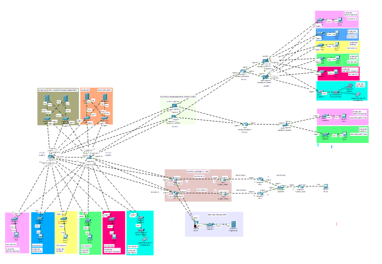

# Enterprise Network Design with Cisco Packet Tracer

A complete enterprise network infrastructure designed and implemented in **Cisco Packet Tracer**, following enterprise networking best practices.

The project simulates a multi-site company composed of a Headquarters (HQ) and two remote branches, implementing secure communication, dynamic routing, network segmentation, high availability, enterprise services, and multiple security mechanisms.

---

## Project Overview

This project was developed as part of a Computer Networks course with the objective of designing a scalable, secure, and fault-tolerant enterprise network from scratch.

The infrastructure includes:

- Headquarters (HQ)
- Branch Office 1 (IPv4)
- Branch Office 2 (IPv6)
- Centralized server infrastructure
- Enterprise security services
- Public and private web services
- Dynamic routing (OSPF / OSPFv3)
- High availability mechanisms
- WAN connectivity
- Internet access simulation

---

## Features

- Hierarchical Collapsed Core Architecture
- Department-based VLAN Segmentation
- Inter-VLAN Routing
- OSPF Dynamic Routing (IPv4)
- OSPFv3 Dynamic Routing (IPv6)
- IPv4 & IPv6 Addressing
- DHCP Redundancy
- SLAAC Configuration
- HSRP Gateway Redundancy
- Access Control Lists (ACLs)
- Cisco ASA Firewall
- Static & Dynamic NAT
- Site-to-Site VPN
- Remote Access VPN
- Public and Private Web Servers
- Guest Network Isolation
- WAN Connectivity Between Sites

---

## Technologies

| Category | Technologies |
|-----------|--------------|
| Simulation | Cisco Packet Tracer |
| Switching | Cisco Catalyst 3650 Multilayer Switches, Cisco Catalyst 2960 |
| Routing | OSPF, OSPFv3 |
| Network Services | DHCP, SLAAC, NAT, VPN |
| High Availability | HSRP |
| Security | ACLs, Cisco ASA Firewall, VLAN Segmentation |
| Addressing | IPv4, IPv6 |
| Standards | IEEE 802.1Q |

---

# Network Topology

The following figure shows the complete enterprise network implemented in Cisco Packet Tracer.



---

# Project Structure

```text
enterprise-network-design-cisco/
│
├── docs/
│   ├── 01-network-architecture.md
│   ├── 02-ip-addressing-and-vlans.md
│   ├── 03-routing-and-redundancy.md
│   ├── 04-network-services.md
│   ├── 05-security-implementation.md
│   └── 06-network-validation.md
│
├── packet-tracer/
│   └── enterprise-network-design.pkt
│
├── screenshots/
│
├── README.md
└── LICENSE
```

---

# Documentation

Detailed technical documentation is available inside the **docs** directory.

| Document | Description |
|----------|-------------|
| [01 - Network Architecture](docs/01-network-architecture.md) | Enterprise architecture, topology, and design decisions |
| [02 - IP Addressing and VLANs](docs/02-ip-addressing-and-vlans.md) | IPv4/IPv6 addressing plan, VLAN segmentation, DHCP, and inter-VLAN routing |
| [03 - Routing and Redundancy](docs/03-routing-and-redundancy.md) | OSPF, OSPFv3, HSRP, routing configuration, and high availability |
| [04 - Network Services](docs/04-network-services.md) | DHCP, NAT, VPN, web services, wireless infrastructure, and server deployment |
| [05 - Security Implementation](docs/05-security-implementation.md) | ACLs, Firewall, NAT security, VPN security, DMZ, and security policies |
| [06 - Network Validation](docs/06-network-validation.md) | Connectivity testing, troubleshooting, and validation results |

---

# Project Highlights

## VLAN Segmentation

The enterprise network is divided into multiple VLANs to isolate departments, improve security, and reduce broadcast traffic.


---

## Dynamic Routing

Inter-site communication is achieved through OSPF and OSPFv3, allowing automatic route exchange across the enterprise infrastructure.


---

## High Availability

Gateway redundancy is implemented using HSRP to ensure service continuity in case of multilayer switch failure.


---

## Access Control

Extended ACLs restrict access to the compute servers, allowing only authorized departments.


---

## DHCP Services

Redundant DHCP servers automatically assign IPv4 addresses across the enterprise network.


---

## Web Services

### Private Web Server

Internal users can access the corporate web server through its private address.


### Public Web Server

Static NAT publishes the internal web server to the simulated Internet.


---

## Connectivity Validation

End-to-end communication between departments, servers, and remote branches has been successfully verified.


---

# Learning Outcomes

This project allowed me to gain practical experience with:

- Enterprise network design
- Hierarchical network architectures
- Layer 2 and Layer 3 switching
- VLAN implementation
- Inter-VLAN routing
- OSPF and OSPFv3
- IPv4 and IPv6 networking
- DHCP and SLAAC
- HSRP redundancy
- Cisco ASA Firewall
- ACL configuration
- Static and Dynamic NAT
- Site-to-Site VPN
- Remote Access VPN
- Enterprise network troubleshooting
- Cisco Packet Tracer

---

# Repository Contents

This repository includes:

- Cisco Packet Tracer project (.pkt)
- Complete technical documentation
- Enterprise network topology
- Configuration screenshots
- Network validation and testing results

---

# License

This project is distributed under the MIT License.
