# Network Validation

## Overview

The enterprise network was thoroughly validated using Cisco Packet Tracer to verify connectivity, routing, security, redundancy, and service availability.

Although Packet Tracer cannot accurately simulate hardware failures, latency, or production traffic loads, it provides a reliable environment for validating the functional behavior of enterprise network designs.

---

## Connectivity Tests

Basic connectivity tests were performed throughout the network to verify communication between devices located in different departments and remote sites.

Successful end-to-end ICMP tests confirmed that routing was correctly configured and that all internal networks could communicate as expected.

---

## DHCP Validation

Dynamic IP address allocation was successfully verified across the enterprise network.

Client devices automatically received:

- IPv4 address
- Subnet mask
- Default gateway
- DNS configuration

All addresses were assigned from the centralized DHCP servers located at Headquarters.

**Evidence**

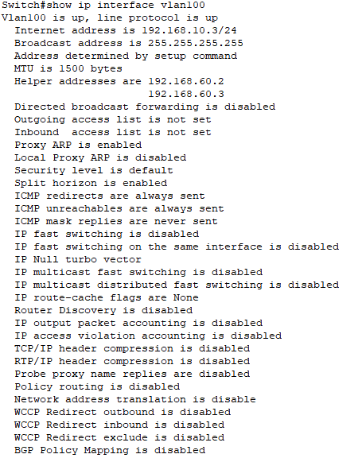

---

## VLAN Verification

The VLAN implementation was validated by confirming proper segmentation of all departments and successful operation of trunk and access ports.

Each department remained logically isolated while maintaining controlled communication through Layer 3 routing.

**Evidence**

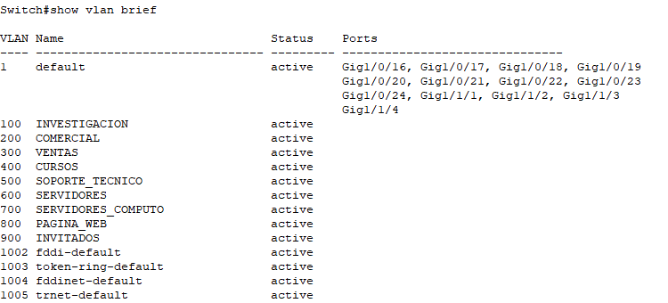

---

## Inter-VLAN Routing Validation

Inter-VLAN routing was successfully tested by sending ICMP traffic between hosts located in different VLANs.

Communication between the Research and Commercial departments confirmed that the multilayer switches correctly routed traffic between VLANs.

---

## OSPF Validation

Dynamic routing between Headquarters and Branch 1 was validated using OSPF Area 0.

Neighbor relationships were successfully established and routing information was exchanged automatically across the WAN links.

**Evidence**

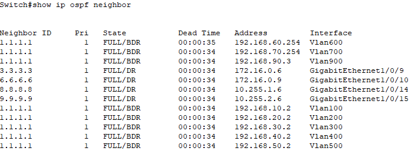

---

## OSPFv3 Validation

IPv6 routing was validated in Branch 2 using OSPFv3.

The successful exchange of IPv6 routes confirmed that the IPv6-only branch could communicate correctly with the Headquarters network.

---

## Routing Table Verification

Routing tables were inspected to verify that all internal networks were correctly learned and propagated.

The routing information confirmed successful dynamic route advertisement and proper path selection across the enterprise.

**Evidence**

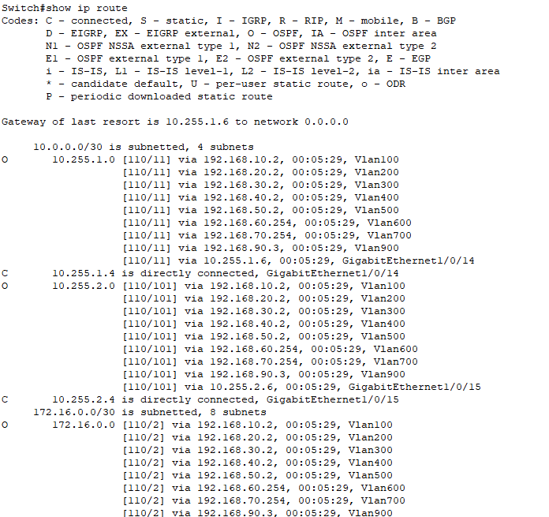

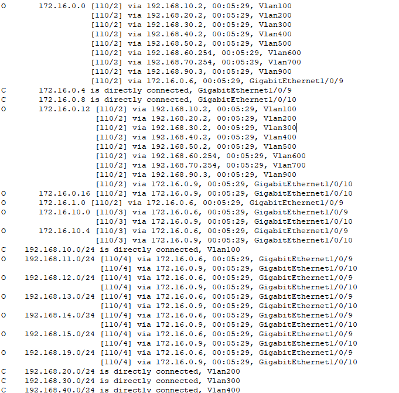

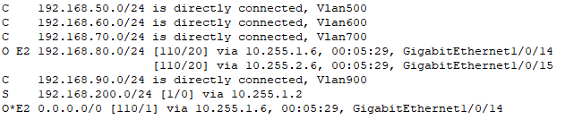

---

## HSRP Validation

Gateway redundancy was validated using Hot Standby Router Protocol (HSRP).

The virtual gateway remained available during failover tests, ensuring uninterrupted connectivity if one multilayer switch became unavailable.

**Evidence**

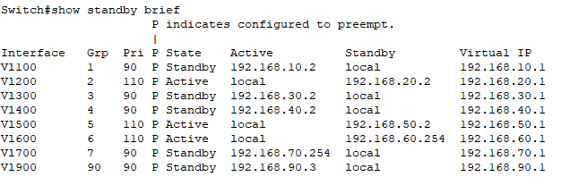

---

## ACL Validation

Access Control Lists were tested to verify that security policies were correctly enforced.

The validation confirmed that:

- Research and Technical Support departments could access the Compute Server VLAN.
- Unauthorized departments were denied access.

**Evidence**

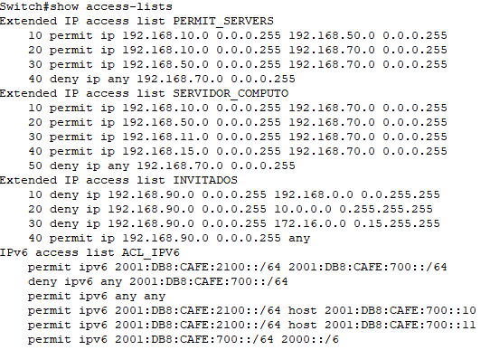

---

## NAT Validation

Static NAT was successfully validated by confirming that the internal web server could be reached from external networks using its public IP address.

Dynamic NAT (PAT) was also verified during Internet connectivity testing for internal users.

---

## Web Server Validation

The corporate website was successfully accessed from both internal and external networks.

### Internal Access

The web server was reachable through its private IP address.

**Evidence**

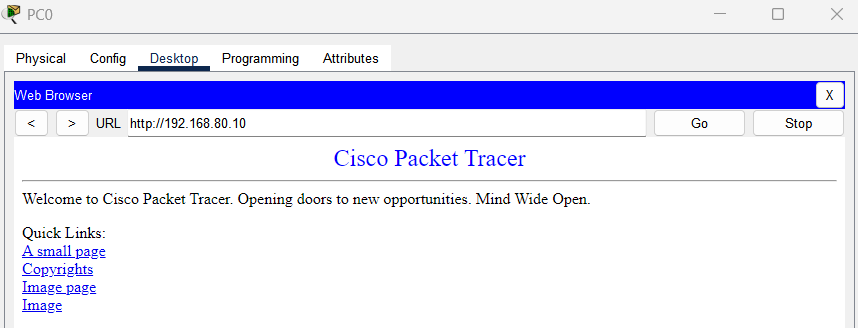

### External Access

External users successfully reached the same service using the public IP address through Static NAT.

**Evidence**

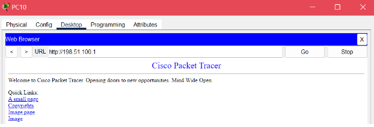

---

## VPN Validation

Remote Access VPN connectivity was successfully established using the configured authentication credentials.

The VPN client confirmed successful tunnel establishment, allowing secure access to internal corporate resources.

Site-to-Site VPN connectivity between Headquarters and Branch 1 was also validated.

---

## High Availability Tests

Several redundancy mechanisms were tested throughout the infrastructure.

The following scenarios were successfully verified:

- HSRP gateway failover
- Redundant DHCP services
- Dual ISP Internet connectivity
- Automatic failover using floating static routes

These mechanisms ensured continuous network availability during simulated failures.

---

## End-to-End Communication

End-to-end connectivity tests were performed across the complete enterprise network.

Successful communication confirmed:

- Headquarters ↔ Branch 1 connectivity
- Headquarters ↔ Branch 2 connectivity
- Inter-department communication
- Server accessibility
- Internet connectivity

**Evidence**

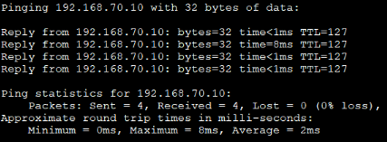

---

## Troubleshooting

Several issues were identified during the implementation process.

The most significant challenges included:

- Initial OSPF route propagation failures.
- Missing collapsed core architecture.
- NAT translation issues.
- VPN access restrictions.
- Guest network isolation problems.
- Lack of gateway redundancy for the web server.

Each issue was analyzed, corrected, and validated before completing the final deployment.

---

## Solutions Applied

The final implementation introduced several improvements, including:

- Deployment of a collapsed core architecture.
- Complete OSPF configuration across all required networks.
- HSRP gateway redundancy.
- Redesigned NAT policies.
- VPN policy adjustments.
- Strict ACL implementation.
- Complete Guest VLAN isolation.

These improvements significantly increased the reliability, scalability, and security of the network.

---

## Final Results

The validation process confirmed that the enterprise network satisfies all functional requirements defined during the project.

The final infrastructure provides:

- Reliable inter-site connectivity
- Dynamic IPv4 and IPv6 routing
- Secure network segmentation
- High availability mechanisms
- Protected Internet services
- Secure VPN connectivity
- Controlled access to critical resources

The project demonstrates a complete enterprise network implementation following industry best practices for scalability, redundancy, and security.
